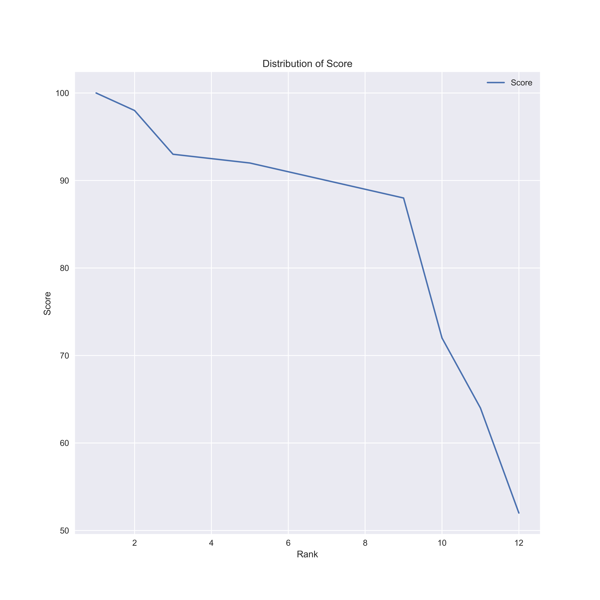

<h1 style='text-align:center'> Problem 2 with Go</h1>
<p style="text-align:right"> Provided by <b> Tae Geun Kim </b></p>

## 1. Roll Dice

1. Make Roll function :``` Input-int, output-[]int64 (The number of rolling, Result)```
    ```Go
    func Roll(n int) []int64 {
	    Result := make([]int64, n, n)
	    rand.Seed(int64(time.Now().Nanosecond()))
	    for i := range Result {
		    results := rand.Intn(6) + 1
		    Result[i] = int64(results)
	    }
	    return Result
    }
    ```
    * rand.Seed(n int64) : There is no true random. Thus should use Seed
    * rand.Intn(n int) : From 0 to n-1 random number
    * Slice can change value (Result[i] = ~)
<br>

2. Make Quincunx function :``` Input-[]int64, output-float64 (Result, probability)```
    ```Go
    func Quincunx(array []int64) float64 {
	    length := float64(len(array))
	    count := 0
	    for _, elem := range array {
		    if elem == 5 {
			    count++
		    }
	    }
	    return float64(count) / length
    }
    ```
    * Go has Auto enumerate : ```for _, elem := range array``` - index, element

## 2. Sort List

1. Make some types
    ```Go
    // PhysicsTest includes name & score
    type PhysicsTest struct {
	    Name  string
	    Score int
    }

    // String() is just string method
    func (p PhysicsTest) String() string {
	    return fmt.Sprintf("%s: %d", p.Name, p.Score)
    }

    // PhysicsList : Let's type to list
    type PhysicsList []PhysicsTest

    // NewContainer contains rank
    type NewContainer struct {
	    Inform PhysicsTest
	    Rank   int
    }
    ```
    * PhysicsTest : ```A := PhysicsTest{"Schrodinger", 66}``` $\Rightarrow$ ```Print(A.Name) -> "Schrodinger"```
    * String() : method for PhysicsTest ```Print(A) ->  "Schrodinger": 66 ```
    * PhysicsList : Array of PhysicsTest
    * NewContainer : PhysicsTest + Rank
    * Example:
        ```Go
        func main() {
            A := PhysicsTest{"Schrodinger", 66}
            B := NewContainer{A, 6}
            fmt.Println((B.Inform, B.Rank))
        }
        ```
        **Q.** What's the output?
<br>

2. Method for PhysicsList

    ```Go
    func (p PhysicsList) Len() int           { return len(p) }
    func (p PhysicsList) Swap(i, j int)      { p[i], p[j] = p[j], p[i] }
    func (p PhysicsList) Less(i, j int) bool { return p[i].Score < p[j].Score }

    // Mean is mean
    func (p PhysicsList) Mean() float64 {
        s := 0
        l := p.Len()
        for _, elem := range p {
            s += elem.Score
        }
        return float64(s) / float64(l)
    }

    // Std is std
    func (p PhysicsList) Std() float64 {
        s := float64(0)
        l := p.Len()
        m := p.Mean()
        for _, elem := range p {
            s += math.Pow(float64(elem.Score)-m, 2)
        }
        return math.Sqrt(s / (float64(l) - 1)) // -1 means sample
    }
    ```
    * Len, Swap, Less : Necessary method for sorting (ex: ```A.Len() : length of A ```)
    * Mean, Std : As you know. But let's see more specifics.
        ```Go
        for _, elem := range p {
            s += elem.Score
        }
        ```
        * ```p : PhysicsList ([]PhysicsTest)```
        * ```elem : PhysicsTest (which has Name & Score)```
<br>

3. Method for NewContainer

    ```Go
    func (Elem NewContainer) String() string {
        return fmt.Sprintf("%s, %d, %d\n", Elem.Inform.Name, Elem.Inform.Score, Elem.Rank)
    }

    // AssignRank - rank
    func (Elem *NewContainer) AssignRank(n int) { Elem.Rank = n }

    // AssignInform - inform
    func (Elem *NewContainer) AssignInform(value PhysicsTest) { Elem.Inform = value }

    // Rank ranks list
    func Rank(SortedArray PhysicsList) []NewContainer {
        length := SortedArray.Len()
        Temp := make([]NewContainer, length, length)
        for i := range SortedArray {
            if i > 0 && SortedArray[i].Score == SortedArray[i-1].Score {
                Temp[i].AssignRank(int(Temp[i-1].Rank))
            } else {
                Temp[i].AssignRank(int(i + 1))
            }
            Temp[i].AssignInform(SortedArray[i])
        }
        return Temp
    }
    ```
    * ```(Elem NewContainer) : Normal Receiver - Does not change value```
    * ```(Elem *NewContainer) : Pointer Receiver - Change Value```
        ```Go
        func main() {
            A := PhysicsTest{"Schrodinger", 66}
            var B NewContainer
            B.AssingInform(A)
            B.AssignRank(6)
            fmt.Println(B.Inform.Name, B.Rank)
        }
        ```
    * How to handle Joint Rank? : 
        * ```SortedArray : PhysicsList ([]PhysicsTest)```
        * ```SortedArray[i] : PhysicsTest (has Name, Score) ```
        * ```SortedArray[i] .Score == SortedArray[i-1].Score : Same Score (Joint)```
        * ```Temp : []NewContainer -> Temp[i] : NewContainer```
        * ```Temp[i].AssignRank(int(Temp[i-1].Rank)) : Same rank assign``` 
<br>

4. Ready to write CSV
    ```Go
    // ConvertString converts string list
    func ConvertString(C []NewContainer) [][]string {
        length := len(C)
        Temp := make([][]string, length, length)
        for i, elem := range C {
            Temp[i] = []string{fmt.Sprint(elem.Inform.Name), fmt.Sprint(elem.Inform.Score), fmt.Sprint(elem.Rank)}
        }
        return Temp
    }

    // -----------------------------
    // Package/csv/csv.go
    // -----------------------------

    // Write writes csv file
    func Write(List [][]string, name string) {
        Title := name
        file, err := os.Create(Title)
        checkError("Cannot create a file", err)
        defer file.Close()

        writer := csv.NewWriter(file)
        defer writer.Flush()

        for _, value := range List {
            err := writer.Write(value)
            checkError("Cannot write to file", err)
        }
        fmt.Println("Complete to Write")
    }

    func checkError(message string, err error) {
        if err != nil {
            log.Fatal(message, err)
        }
    }
    ```
    * I made csv package (contain Read & Write & CheckError)
        * Write : ```Input: [][]string, string -> Output: Nothing but .csv file```
        * CheckError : ```Input: string, error -> Output: Nothing but exit```
    * Thus make ```ConvertString``` function
        * ```Input: []NewContainer -> Output: [][]string```
        * ```fmt.Sprint: convert any value to string```
<br>

5. Main Function
    ```Go
    // DoSort do sort
    func DoSort() {
        fmt.Println("---------------------------------------")
        fmt.Println("Sort List")
        fmt.Println("---------------------------------------")
        A := PhysicsList{
            {"Schrodinger", 64},
            {"Einstein", 90},
            {"Feynman", 98},
            {"Neumann", 100},
            {"Dirac", 92},
            {"Bohr", 90},
            {"Fermi", 91},
            {"Heisenberg", 72},
            {"Pauli", 88},
            {"Newton", 93},
            {"Leibniz", 93},
            {"Planck", 52},
        }

        // Sorting
        sort.Sort(sort.Reverse(A))

        // Statistic
        fmt.Printf("Average: %f\n", A.Mean())
        fmt.Printf("Std: %f\n ", A.Std())

        // Add Rank
        Result := Rank(A)

        // Write CSV
        Data := ConvertString(Result)
        csv.Write(Data, "../Data/physics.csv")

        // Read CSV
        List := csv.Read("../Data/physics.csv")
        Physicsists := make([]string, len(List), len(List))
        Scores, Ranks := make([]int64, len(List), len(List)), make([]int64, len(List), len(List))
        for i, group := range List {
            Physicsists[i] = group[0]
            Scores[i], _ = strconv.ParseInt(group[1], 0, 64)
            Ranks[i], _ = strconv.ParseInt(group[2], 0, 64)
        }
        fmt.Println(Ranks)
    }
    ```
    * Read : ```Input: csv -> Output: [][]string ```
<br>

6. Plotting in Python
    ```Python
    # ==============================================================================
    # Python Import Session
    # ==============================================================================

    import matplotlib.pyplot as plt
    import seaborn

    # ==============================================================================
    # Receive Sequence
    # ==============================================================================

    temp = open("Data/physics.csv")
    List = [line.split(',') for line in temp]
    Name, Score, Rank = [], [], []
    for group in List:
        Name.append(group[0])
        Score.append(int(group[1]))
        Rank.append(int(group[2]))

    # ==============================================================================
    # Plotting
    # ==============================================================================

    plt.figure(figsize=(10,10), dpi=600)
    plt.plot(Rank, Score, label='Score')
    plt.title("Distribution of Score")
    plt.xlabel('Rank')
    plt.ylabel('Score')
    plt.legend()
    plt.savefig('Fig/Distrib.png')
    ```
    * Read is so simple : ```open & line.split by list comprehension```
    </img>

## 3. Rock, Scissors, Paper!

1. Declare new type for play
    ```Go
    // Score is type for scoring
    type Score struct {
        player int
        enemy  int
        draw   int
    }
    ```
<br>

2. Make map for RSP
    ```Go
    // RSP for rsp
    var RSP = map[string]int{
        "가위": -1,
        "바위": 0,
        "보":  1,
    }
    ```
    * Map of Go seems like "Dict" of Python : ```RSP["가위"] -> -1```

<br>

3. Make 'Judge' method for Score
    ```Go
    // Judge for Score
    func (s *Score) Judge(x, y int) {
        // At least one of them throw rock
        if x*y == 0 {
            if x > y {
                s.player++
            } else if x < y {
                s.enemy++
            } else {
                s.draw++
            }
        } else if x*y < 0 { // one is scissors, another one is paper
            if x < 0 {
                s.player++
            } else {
                s.enemy++
            }
        } else {
            s.draw++
        }
    }
    ```
    * ```if x*y == 0 ``` : at least one of them throw rock
        * ```if x <  y``` : x = Rock & y = Paper or x = Scissors & y = Rock -> So, y wins
    * ```else if x*y < 0``` : one = Scissors & another one = Paper
        * ```if x < 0 ``` : x = scissors -> x Win!
    * ```else``` : Both are paper -> Draw 
<br>

4. Make 'Play' method for Score (Scan integer n (number of play))
    ```Go
    // Play is method for Score
    func (s *Score) Play(n int) {
        for i := 0; i < n; i++ {
            fmt.Println("가위, 바위, 보를 시작합니다. 가위, 바위, 보!")
            var player string
            _, err := fmt.Scan(&player)
            temp := []string{"가위", "바위", "보"}
            if err != nil || !check.Contains(player, temp) {
                fmt.Println("똑바로 입력하세요.")
                os.Exit(1)
            }
            enemy := AI()
            s.Judge(RSP[player], RSP[enemy])
        }
    }
    ```
    * Scan should be scan pointer
    * I made ```check.Contains``` which check list contains specific element.
        ```Go
        package check

        // Contains check contain
        func Contains(x string, A []string) bool {
            for _, elem := range A {
                if x == elem {
                    return true
                }
            }
            return false
        }
        ```
        * ```!check.Contains(player, temp)``` : "```if player not in temp```" in python
<br>

5. Make A.I (In fact, just random generator)
    ```Go
    //AI for Rsp
    func AI() string {
        rand.Seed(int64(time.Now().Nanosecond()))
        number := rand.Intn(3)
        List := [3]string{"가위", "바위", "보"}
        return List[number]
    }
    ```
<br>

6. Main function
    ```Go
    //DoRSP !
    func DoRSP() {
        fmt.Println("---------------------------------------")
        fmt.Println("Rock Scissors Paper!")
        fmt.Println("---------------------------------------")
        var n int
        fmt.Println("How many times you want to play RSP?")
        fmt.Scanln(&n)
        var Count Score
        Count.Play(n)
        fmt.Printf("Player: %v, Computer: %v, Draw:%v\n", Count.player, Count.enemy, Count.draw)
    }

## 4. Virtual Calendar

1. Declare type for Calendar
    ```Go
    // Date is default struct
    type Date struct {
        year  int
        month int
        day   int
    }
    ```
<br>

2. Make some maps
    ```Go
    // Ref is reference for month
    var Ref = map[int]int{
        1:  31,
        3:  31,
        4:  30,
        5:  31,
        6:  30,
        7:  31,
        8:  31,
        9:  30,
        10: 31,
        11: 30,
        12: 31,
    }

    // Ref2 for days
    var Ref2 = map[int]string{
        0: "Sunday",
        1: "Monday",
        2: "Tuesday",
        3: "Wednesday",
        4: "Thursday",
        5: "Friday",
        6: "Saturday",
    }
    ```
    * Usage :
        ```Go
        func main() {
            A := Date{2017, 07, 18}
            Ref[2] = 28
            fmt.Println(Ref[A.month])
            fmt.Println(Ref2[3])
        }
        ```
        **Q.** What is the output?
<br>

3. Make some methods for Date
    ```Go
    // Days generates number of days
    func (d Date) Days() int {
        s := 0
        if d.year%4 == 0 {
            if d.year%100 != 0 || d.year%400 == 0 {
                Ref[2] = 29
                for i := 1; i < d.month; i++ {
                    s += Ref[i]
                }
                s += d.day
            } else {
                Ref[2] = 28
                for i := 1; i < d.month; i++ {
                    s += Ref[i]
                }
                s += d.day
            }
        } else {
            Ref[2] = 28
            for i := 1; i < d.month; i++ {
                s += Ref[i]
            }
            s += d.day
        }
        return s
    }

    // DayTotal obtain days from 0001.01.01
    func (d Date) DayTotal() int {
        s := 0
        for i := 1; i < d.year; i++ {
            x := Date{i, 12, 31}
            s += x.Days()
        }
        s += d.Days()
        return s
    }
    ```
    * Example :
        ```Go
        func main() {
            A := Date{2017, 07, 18}
            B := A.Days()
            // 2017%4 != 0 -> Into else block -> Ref[2] = 28 -> 31+28+31+30+31+30 -> + day:18
        }
        ```
<br>

4. Make 'DayFinder' function (```input: integer(DayTotal) -> Output: string(day)```)
    ```Go
    func DayFinder(n int) string {
        x := n % 7
        return Ref2[x]
    }
    ```
    * Since 1st of January in 0001 is monday
<br>

5. Main function
    ```Go
    // DoCalendar generates calendar
    func DoCalendar() {
        fmt.Println("---------------------------------------")
        fmt.Println("Calendar")
        fmt.Println("---------------------------------------")
        var year, month, day int
        fmt.Print("날짜를 입력하세요 (년, 월, 일): ")
        _, err := fmt.Scanln(&year, &month, &day)
        if err != nil {
            fmt.Println("값이 잘못되었습니다.")
            os.Exit(1)
        }
        d := Date{year, month, day}
        fmt.Printf("입력하신 날짜는 서기 %d일이며 %s입니다.\n", d.DayTotal(), DayFinder(d.DayTotal()))
    }
    ```
<br>

## 5. Total Main Function (In cmd folder)

```Go
package main

import (
	"runtime"
	"sync"
	"time"

	"github.com/Axect/Go/CS/prob2"
)

var wg sync.WaitGroup

func main() {
	runtime.GOMAXPROCS(4)
	go prob2.DoRoll()
	go prob2.DoSort()
	time.Sleep(100 * time.Millisecond)
	prob2.DoRSP()
	prob2.DoCalendar()
}
```
* ```runtime.GOMAXPROCS(4)``` : Use 4 cores
* ```go``` : Concurrent running